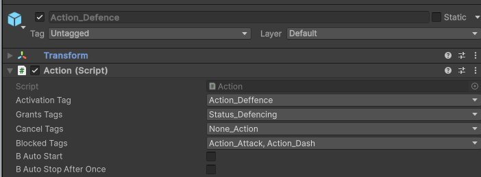
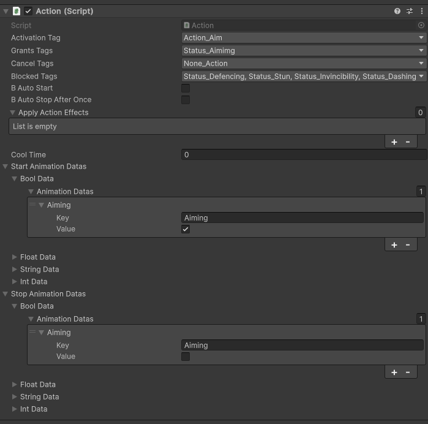
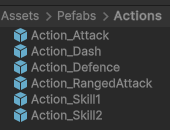
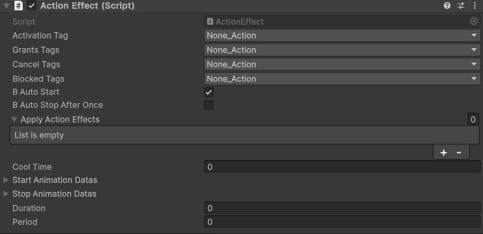
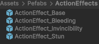
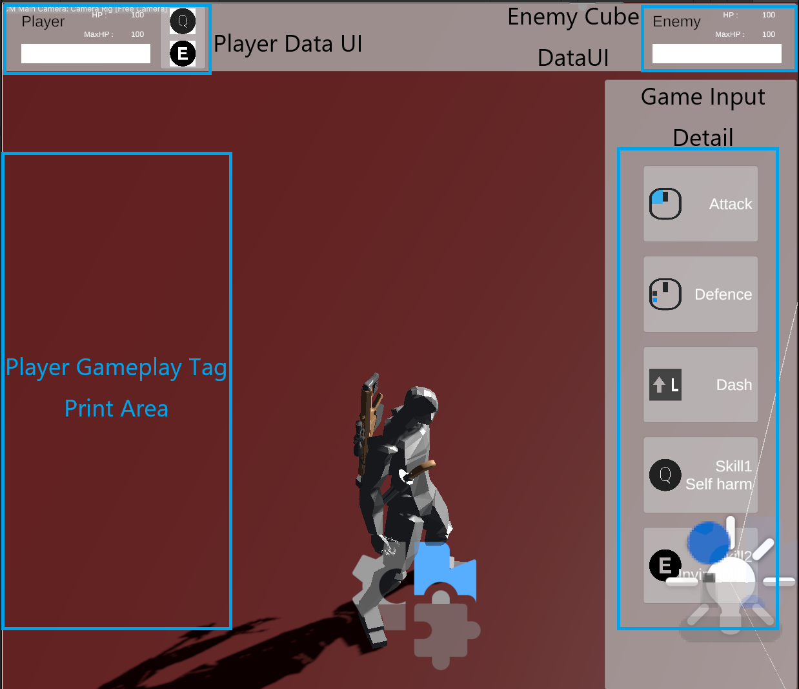

# 주제

## UE의 GameplayAbilitySystem을 모방 하여 제작 한 시스템 UnityActionSystem  
## 기본 GameplayTag는 Enum으로 대체  

## Action을 이용하여 기능 추가.  
## ActionEffect를 이용해 캐릭터간의 상호작용 추가.  

# 작업 기간 : 2025/02/25 ~ 2025/03/02 (6일)
## 환경 : Unity6 / VS2022

# 주요 기능 요약
## Player의 현재 Active 된 GameplayTag들을 기반으로 상호작용 및 Action을 관리
## ex)  Defence중 Attack을 하지 못하게 설정 하는 Case  
## Defence 중에는 Status_Defencing이 켜져있음.
## Attack을 실행하려고 체크 시 Attack에 Blocked로 설정 해 둔 Status_Defencing에 의해 Start를 못하도록 Block

  

# Action
  
Activation Tag : Action의 Unique 확인용 Tag 해당 Tag를 이용해 Action 적용 가능.  
Grants Tags : 해당 Action 소유주에게 부여 할 Tags 정의.  
Cancel Tags : Action 수행 시 활성화 돼 있는 Action을 정지 시킬 Tags 정의.  
Blocked Tags : 해당 Action 실행 전 Blocked Tags로 정의된 Tag를 Action 소유주가 보유 시 해당 Action 실행 불가.  
AutoStart : AddAction시 바로 시작 여부.  
AutoStopAfterOnce : 실행 직후 해제 여부.  
ApplyActionEffects : 특정 Target에 ActionEffects를 적용할 List 적용 할 Action은 IApplyActionEffectsInterface 상속 필요.  
Cool Time : 각 Action  별 쿨타임 설정. 쿨타임 중에는 스킬 사용 불가.  
Start Animation Datas, Stop Animation Datas : 각 상황 별 실행, 중지 애니메이션 데이터 세팅을 위한 내용 정의.

## 생성 Action
  
Action_Attack : Mouse 우클릭 : 공격 (Action_RangedAttack상세 원거리 공격 적용)  
Action_Defence : Mouse 좌클릭 : 방어  
Action_Skill1 : Q : 본인 체력 감소 확인용 스킬 (출혈 효과 적용)  
Action_Skill2 : E : 무적 효과 적용  
Action_Dash : L Shift : 무적 효과 적용  

# ActionEffect
  
기본 Action을 상속받아 위 서술한 부분은 생략  
Duration : ActionEffect 를 적용할 시간  
Period : 해당 ActionEffect를 적용할 주기  
즉 Duration 동안 Period 가 지날 때 마다  ActionEffect적용  
적용 횟수 : Duration / Period  

## 생성 ActionEffect
  
ActionEffect_Base : 특정 시간, 주기 동안 어떤 효과를 적용 시킬 지 설정 가능  
ActionEffect_Bleeding : 출혈 효과 : Target의 체력을 dot damage로 감소  
ActionEffect_Invincibility : 무적 효과 : 적용 Target의 체력 감소 효과를 무시  

# UI

Unity InputSystem에 Bind 된 Key 설명 UI  
캐랙터들의 name과 HP Update를 적용  
현재 캐릭터에게 부여된 Tag들을 상단에서 표시  
스킬 쿨타임 UI : 남아있는 시간을 확인하며 UI 갱신

# 프로젝트 링크
# [Github](https://github.com/yoon20002000/UnityGameplayActionSystem)